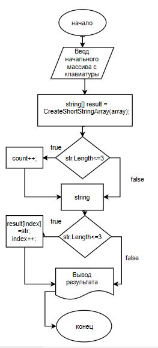

# Программа ShortStrings

Программа ShortStrings предназначена для создания нового массива из строк, длина которых меньше, либо равна 3 символам.

## Как использовать

1. Запустите программу
2. Введите элементы массива через запятую
3. Программа выведет новый массив из строк, длина которых меньше, либо равна 3 символам

Пример ввода: "Hello", "2", "world", ":-)"
Пример вывода: "2", ":-)"
### Блок схема 

